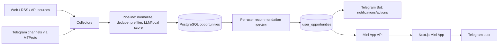

# Hunt Agent — handoff для GPT-5.6 Sol

> UI contract: перед любым изменением frontend или Telegram UI полностью прочитать `PRODUCT.md`, `DESIGN.md` и `docs/FRONTEND_RULES.md`. Colorblock Studio — утверждённое направление; одноразовые UI-блоки и текст меньше 13px запрещены.

> Актуально на 31 августа 2026. Этот документ самодостаточен: его можно дать
> следующему агенту вместе с репозиторием. Секреты, токены, пароли и значения
> `.env` намеренно не включены.

## 1. Назначение и продуктовые границы

**Hunt Agent** — self-hosted Telegram-first сервис для поиска фриланс-заказов и
вакансий. Он собирает возможности, очищает и дедуплицирует их, оценивает
релевантность под каждого пользователя, предлагает портфолио-кейс и готовит
черновик отклика. Telegram-бот сообщает о срочных лидах, Mini App — основной
кабинет.

Целевая аудитория: разработчики, SMM/marketing, designers, video/motion/CG и
copywriters. Интерфейс Russian-first.

Не нарушать следующие инварианты:

- данные, рекомендации, статусы и предложения строго изолированы по Telegram user id;
- Mini App авторизуется только серверной проверкой Telegram `initData`;
- нет автосообщений от имени пользователя и нет обхода CAPTCHA/авторизации площадок;
- `APPROVE` означает создание/редактирование черновика, а не факт внешней отправки;
- токены и платёжные секреты остаются только в `.env`, который не коммитится;
- до подтверждения владельца новые фичи тестируются локально, затем собираются и
  выкатываются на VPS. При дальнейших деплоях никогда не перезаписывать remote `.env`.

## 2. Текущее состояние — кратко

| Область | Состояние |
| --- | --- |
| Git | Локальный репозиторий, рабочее дерево чистое, remote пока не задан. |
| Production | VPS `109.73.205.245`, проект в `/opt/hunt-agent`, Compose project `huntagent`. |
| Public URL | `https://tg.vzyalzakaz.ru/app`; HTTP перенаправляет на HTTPS. |
| Bot | `@vzyal_zakaz_bot`, long polling включён, команды и Web App menu button настроены. |
| Авторизация Mini App | Production: `ALLOW_DEV_AUTH=false`; прямое открытие в обычном браузере не является логином. |
| Планировщик | Включён; восемь устойчивых web/API/RSS-источников активны. |
| Telegram channel collector | Выключен: нужны MTProto credentials общего аккаунта. |
| LLM | Production health сообщает provider `deepseek`; ключ находится только в remote `.env`. |
| ЮKassa | Код и тестовый flow готовы; production credentials намеренно не внесены, поэтому checkout на production недоступен. |

Production health endpoint: `GET https://tg.vzyalzakaz.ru/api/health`.

## 3. Карта репозитория

```text
job_hunter/
├── app/                         # FastAPI backend
│   ├── main.py                  # lifespan, запуск Runtime, FastAPI routers
│   ├── config.py                # Pydantic Settings + YAML configuration models
│   ├── database.py              # async SQLAlchemy engine/session
│   ├── models.py                # PostgreSQL models
│   ├── api.py                   # legacy/loopback API: health, raw leads, analytics, collect
│   ├── mini_app_api.py          # защищённые маршруты Mini App и ЮKassa webhook
│   ├── mini_app_auth.py         # Telegram initData HMAC и app session token
│   ├── runtime.py               # scheduler, bot, Telegram collector lifecycle
│   ├── collectors/
│   │   ├── base.py              # polite HTTP helpers/retries
│   │   └── web.py               # HH, Remotive, RemoteOK, Arbeitnow, HN, WWR, Jobicy adapters
│   ├── services/
│   │   ├── pipeline.py          # normalization → prefilter → analysis → persistence
│   │   ├── recommendations.py   # per-user matches, proposal, backfill
│   │   ├── scoring.py           # LLM/local structured analysis
│   │   ├── normalizer.py        # canonical raw opportunity data
│   │   ├── prefilter.py         # cheap anti-noise rules
│   │   ├── ranking.py           # FIT / MONEY / WIN / freshness
│   │   ├── collector_runner.py  # source run bookkeeping + notifications
│   │   └── payments.py          # server-only YooKassa interaction
│   └── telegram/
│       ├── bot.py               # Bot API polling, commands, callbacks, menu Web App
│       └── collector.py         # Telethon MTProto channel reader
├── frontend/                    # Next.js 16 Telegram Mini App
│   ├── src/components/features/ # onboarding, lead feed/details, profile, portfolio,
│   │                            # applications, analytics, billing, Telegram shell
│   └── src/lib/                 # API client, Telegram WebApp bridge, mappings/copy
├── config/
│   ├── candidate_profile.yaml   # стартовый profile владельца
│   ├── portfolio.yaml           # стартовые portfolio cases владельца
│   └── sources.yaml             # все source definitions и интервалы
├── migrations/versions/         # Alembic: 0001, 0002 multi-user, 0003 payments
├── nginx/
│   ├── default.conf             # local HTTP reverse proxy
│   └── production.conf          # HTTPS, ACME path, redirect and reverse proxy
├── tests/                       # backend unit tests
├── compose.yaml                 # local/staging-like Docker Compose
├── compose.production.yaml      # VPS HTTPS override and Telegram routing workaround
├── Dockerfile                   # Python backend image
├── PRODUCT.md                   # product principles
├── DESIGN.md                    # visual system and UI constraints
├── README.md                    # setup/runbook (partly historical; this handoff is newer)
└── docs/
    ├── ROADMAP.md               # prioritized product roadmap
    └── GPT56_SOL_HANDOFF.md     # this document
```

## 4. Архитектура и данные



Главные таблицы в `app/models.py`:

- `opportunities` — глобальная нормализованная возможность;
- `source_occurrences` — репосты/дубликаты одной возможности;
- `collector_runs` — health и результаты каждого запуска source;
- `telegram_users` — изолированный пользовательский профиль/portfolio JSON;
- `user_opportunities` — персональная оценка, proposal, status, skip reason;
- `payments` — idempotency и состояние ЮKassa платежа.

Статусы lead: `new → filtered/recommended → approved → contacted → replied/interview → won/lost`,
а также `skipped`. Статус в `UserOpportunity`, а не глобальный `Opportunity`, где это
имеет значение для многопользовательского режима.

## 5. Backend API и auth

Все routers имеют `/api` prefix.

- Public/health: `GET /health`.
- Legacy API (`app/api.py`): leads, analytics, manual `POST /collect/{source_name}`.
  В production backend слушает только `127.0.0.1`; не считать эти endpoints публичным
  multi-user API.
- Mini App auth: `POST /mini-app/auth` принимает Telegram `initData`, валидирует HMAC,
  выдаёт подписанную сессию. `POST /mini-app/auth/dev` существует только для local dev.
- Mini App cabinet: `/app/me`, `/app/leads`, proposal/skip/contacted, `/app/analytics`,
  `/app/portfolio`, `/app/agent`.
- Персональная лента хранит совпадения от `60%`. Отдельный realtime-порог Telegram-
  уведомлений настраивается пользователем в Mini App в диапазоне `60–95%` и по
  умолчанию равен `82%`. Изменение только порога не запускает полный backfill.
- Billing: `GET /app/billing`, checkout, refresh и `POST /webhooks/yookassa`.

`app/mini_app_auth.py` обязан остаться единственной точкой доверия Telegram initData.
Никогда не переносить Bot token во frontend и не принимать Telegram user id от браузера
как доказательство личности.

## 6. Frontend

Маршрут кабинета: `frontend/src/app/app/page.tsx`; orchestration находится в
`components/features/telegram-shell/HuntApp.tsx`. API-функции и типы —
`frontend/src/lib/api/client.ts` и `src/types/domain.ts`.

Уже сделаны onboarding, лента лидов, detail/proposal, pipeline, profile, portfolio,
analytics, pause/resume и BillingCard. UI должен соблюдать `PRODUCT.md` и `DESIGN.md`:
спокойный рабочий инструмент, не «neon AI dashboard», mobile-first, Telegram-safe areas,
не показывать ложный статус «отправлено».

## 7. Источники и расписание

`config/sources.yaml` содержит:

- много Telegram каналов для dev и digital-специалистов; definitions включены, но
  Telethon collector отключён на production до появления MTProto credentials;
- активные production web sources: `remoteok`, `hackernews`, три We Work Remotely RSS
  (general/design/marketing), три Jobicy API (marketing/design-multimedia/copywriting);
- `remotive*` и `arbeitnow` отключены: с этого VPS отвечают `403`;
- `hh_ru` отключён: endpoint недоступен из текущей сети.

Не включать заблокированные источники «вслепую»: сначала сделать read-only проверку с
VPS, затем включить в YAML и наблюдать `collector_runs`. Scheduler создаёт одну job на
активный non-Telegram source (`app/runtime.py`), с `max_instances=1` и `coalesce=True`.

## 8. Local и production runbook

### Local

- Рабочая папка: `/Users/hapkovaleksandr/Documents/ChatGPT/job_hunter`.
- Docker Compose: `docker compose up -d --build`.
- Nginx: `http://localhost:8010`; backend на `127.0.0.1:8001`.
- Local `.env` содержит только local/test settings, `ALLOW_DEV_AUTH=true`.
- Для долгого polling тестовый bot token разрешено использовать только локально.

Проверки перед commit/deploy по возможности:

```bash
ruff check app tests migrations
pytest
cd frontend && npm run typecheck && npm run lint && npm run build
git diff --check
```

Последний полный набор этих проверок прошёл 1 сентября 2026 года: `23 passed`, Ruff,
TypeScript, ESLint, production build и `git diff --check`. Production Bot API (`getMe`,
`getWebhookInfo`, `getMyCommands`) и все восемь web collector runs проверены отдельно.

### VPS

- SSH: `root@109.73.205.245`.
- Application directory: `/opt/hunt-agent`.
- Compose: `docker compose -p huntagent -f compose.yaml -f compose.production.yaml …`.
- Containers: `postgres`, `jobhunter`, `frontend`, `nginx`.
- Public: only Nginx ports `80` and `443`; backend `127.0.0.1:8000`.
- PostgreSQL and Telethon session are Docker volumes. Не удалять volumes при cleanup.

Для будущего code deploy (после локального подтверждения) переносить source без `.env`:

```bash
rsync -az --exclude '.git/' --exclude '.env' --exclude '.venv/' \
  --exclude 'frontend/node_modules/' --exclude 'frontend/.next/' \
  ./ root@109.73.205.245:/opt/hunt-agent/

ssh root@109.73.205.245 '
  cd /opt/hunt-agent &&
  docker compose -p huntagent -f compose.yaml -f compose.production.yaml build jobhunter frontend &&
  docker compose -p huntagent -f compose.yaml -f compose.production.yaml up -d
'
```

Не выполнять `rsync --delete` без отдельной проверки. Не копировать local test bot token
и test YooKassa values на production.

### HTTPS и Telegram networking

- Certbot certificate для `tg.vzyalzakaz.ru` выдан. Nginx production config обслуживает
  ACME challenge и перенаправляет HTTP → HTTPS.
- На VPS добавлено ежедневное `certbot renew` в root crontab с последующим Nginx reload.
- VPS DNS для `api.telegram.org` отдавал недоступный IP `149.154.166.110`.
  В `compose.production.yaml` у `jobhunter` закреплён working route
  `api.telegram.org:149.154.167.220` через `extra_hosts`. Это сохраняет hostname/SNI/TLS.
  Проверять этот маршрут при любых Telegram timeouts; если он перестанет отвечать,
  найти доступный Bot API IP с VPS и обновить только этот override.
- `app/telegram/bot.py` использует `aiohttp` с `AF_INET` именно для Bot API.

## 9. Production configuration — без значений

В remote `.env` должны быть определены PostgreSQL connection, DeepSeek, production Bot
token, `MINI_APP_URL=https://tg.vzyalzakaz.ru/app`,
`PUBLIC_BASE_URL=https://tg.vzyalzakaz.ru`, session secret, scheduler/bot flags.

Текущие operational flags:

- `ENABLE_TELEGRAM_BOT=true`;
- `ENABLE_SCHEDULER=true`;
- `ENABLE_TELEGRAM_COLLECTOR=false`;
- `ALLOW_DEV_AUTH=false`;
- для тестирования регистрация `open`, `MAX_USERS=20`.

Следующее безопасное ужесточение: владелец присылает свой numeric Telegram ID → записать
`TELEGRAM_OWNER_ID`, сменить `REGISTRATION_MODE=invite`, задать новый long random
`REGISTRATION_INVITE_CODE`. Не печатать invite code в git/логах.

## 10. Billing reality check

Есть полноценный server-side test checkout: idempotency key, Yookassa API call, payment
row, provider refresh и webhook, который не доверяет входящему payload, а повторно
получает status у ЮKassa.

Но это **ещё не весь paid product**:

- нет production YooKassa secret/shop id на VPS;
- нет feature-gating/лимитов тарифа, отмен, grace period и юридического потока;
- `payment_payload()` сейчас возвращает `active_until: null`, хотя дата entitlement
  уже записывается в `TelegramUser.profile["billing"]` при успешной оплате. Это небольшой,
  конкретный следующий fix для BillingCard.

Перед запуском реальных оплат нужны production credentials, финальная цена, notification
URL `https://tg.vzyalzakaz.ru/api/webhooks/yookassa`, определённые entitlement rules и
проверка полной оплаты в sandbox/production.

## 11. Git history и важные коммиты

```text
83299c7 feat: bootstrap multi-user hunt agent
b115e82 feat: add digital sources and YooKassa checkout
14aca36 feat: add production HTTPS proxy
b9dcb41 fix: disable blocked job-board sources
dbd4472 fix: force IPv4 for Telegram API calls
41ee2cc fix: route Telegram API to reachable IPv4
```

`1a271da` был промежуточной попыткой предпочесть IPv4 через `/etc/gai.conf`; он
функционально заменён `dbd4472`/`41ee2cc`. Удалять историю не нужно. Git remote отсутствует:
когда владелец даст URL private GitHub/GitLab, выполнить `git remote add origin …` и
`git push -u origin main`.

## 12. Приоритеты для следующего агента

Сначала взять задачи из `docs/ROADMAP.md`, в этом порядке:

1. Source health / source metrics, spam-risk, deny-list и feedback после Skip.
2. Реальная воронка и follow-up reminders: sent → replied → won/lost.
3. Onboarding presets по профессиям (SMM, video/motion, design, copywriting, marketing).
4. User-facing source preferences и видимая provenance лида.
5. Production monetization: entitlements и политика платежей.

Перед масштабированием Telegram collector получить от владельца только необходимые
`TELEGRAM_API_ID`, `TELEGRAM_API_HASH` и phone; авторизацию Telethon проводить
интерактивно, session держать в Docker volume, не в Git. Перед включением каждого
канала подтвердить легальный доступ обычного аккаунта.

## 13. Что спросить у владельца первым

1. Numeric Telegram ID для owner/admin и выбор: beta open или invite-only.
2. Private Git remote URL.
3. MTProto credentials, если требуется чтение Telegram channels.
4. Решение о тарифе и production YooKassa credentials, когда будет включаться оплата.
